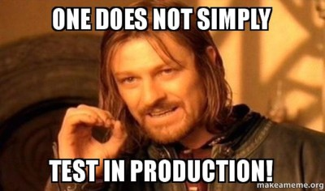
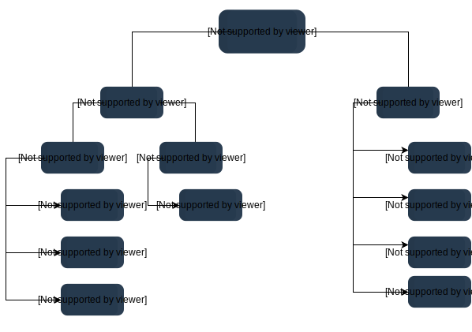
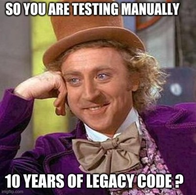

# Les tests

Venez on installe tous node :D

## Pourquoi on fait des tests

### Parce les developpeurs sont humains :

```
(a) Industry Average: "about 15 - 50 errors per 1000 lines of delivered
code." He further says this is usually representative of code that has some
level of structured programming behind it, but probably includes a mix of
coding techniques.

(b) Microsoft Applications: "about 10 - 20 defects per 1000 lines of code
during in-house testing, and 0.5 defect per KLOC (KLOC IS CALLED AS 1000 lines of code) in released
product (Moore 1992)." He attributes this to a combination of code-reading
techniques and independent testing (discussed further in another chapter of
his book).

(c) "Harlan Mills pioneered 'cleanroom development', a technique that has
been able to achieve rates as low as 3 defects per 1000 lines of code during
in-house testing and 0.1 defect per 1000 lines of code in released product
(Cobb and Mills 1990). A few projects - for example, the space-shuttle
software - have achieved a level of 0 defects in 500,000 lines of code using
a system of format development methods, peer reviews, and statistical
testing."
```

[source: Code Complete](https://www.amazon.com/Code-Complete-Practical-Handbook-Construction/dp/0735619670)

###  Parce que le code est important :

<p align="center"></p>
<p align="center"></p>

[Le lancement d'Ariane 5](https://hownot2code.com/2016/09/02/a-space-error-370-million-for-an-integer-overflow/)

<p align="center"></p>

## C'est quoi un test

> ~~Tester c'est douter~~

Tester c'est s'assurer du bon fonctionnement d'un programme.

Il existe beaucoup de types de tests.



Certains sont spécifiques a certaines industries.
Aujourd'hui on va se concentrer sur les types de tests les plus communs.

### Les tests ad-hoc

```
Ad hoc Testing is an informal or unstructured software testing type that aims to break the testing process in order to find possible defects or errors at an early possible stage. Ad hoc testing is done randomly and it is usually an unplanned activity which does not follow any documentation and test design techniques to create test cases.
```

Pour résumer, quand on test 'a la main' c'est ça qu'on fait.

<p align="center"></p>


### Les tests unitaires

Un test unitaire, c'est écrire du code pour aller tester un morceau spécifique de code.

```
Code-based testing involves testing out each line of code of a program to identify bugs or errors during the software development process. Specific test cases are checked on the program to see if it performs the functions required. Moreover, code-based testing can be broken down into structural and static testing.
```

> Un test unitaire ne doit pas interagir avec une DB

> Un test unitaire ne doit pas interagir avec une API


### Les tests d'integrations

Un test d'integration sert aussi a tester du code. Cette fois ci plutot que de tester une petite partie, on va plutot tester un module ou un ensemble.

> par exemple tester un endpoint d'une API


> Un test d'integration peut interagir avec une DB ou une API

> il est commun d'avoir une DB pour les tests d'integrations ou l'on remplit des données pour ces tests.
> Ces données sont souvent appellées `fixtures` ou `seeds`

### Les tests end to end

Un test end-to-end sert a se mettre à la place d'un utilisateur final et de tester, de la meme manière qu'un humain pourrait le faire.

Donc faire un test end-to-end, c'est écrire du code, qui va faire les actions d'un utilisateur (par exemple: cliquer, scroller, appuyer sur un clavier) pour nous.

> On teste donc l'ensemble d'une application

> Les tests end to end sont utiles pour s'assurer que les features principales/importante de notre application fonctionnent bien

> On les lance souvent avant de faire une mise en prod

> Il est fréquent qu'on les lance périodiquement, pour s'assurer qu'une application n'a pas de problème

### les tests de charge

Il est assez frequent pour les sites a très fort trafique d'utiliser des tests de charge pour eprouver leur infrastructure et la robustesse de leurs services.

[Chaosmonkey](https://netflix.github.io/chaosmonkey/)

## Qu'est on y gagne

### Les regressions

> Quand on travaille a plusieurs, parfois git c'est compliqué.

Un regression c'est quand un ajout de code casse une feature qui fonctionnait.
C'est assez frequent quand on travaille a plusieurs, si on fait une erreur lors d'un rebase ou d'un merge.

Avec des tests d'integrations ou des tests end to end, on se rend compte que quelque chose est cassé et on peut rollback, au dernier commit qui fonctionne, ce qui empeche les regressions.

### Le code coverage

> Quand on teste une ligne une code c'est toujours dans la suivante qu'il y a un bug

Le code coverage c'est le fait de regarder combien de % de nos lignes de codes sont couvertes par des tests.
L'idéal c'est de tendre vers 100% mais c'est très rare.

Plus la couverture de code est grande, plus on sera sure de la qualité code.

### La Code Quality

La qualité du code, c'est d'écrire du code avec une architecture efficace (ex: MVC), de la documentation, du code factorisé et facile a comprendre et `des tests`.
Les tests sont une partie, importante, de la `code quality`.

La qualité du code est importante : cf L'Ariane 5

Il est compliqué d'évaluer la qualité du code automatiquement.

Il existe des logiciels (payants :/ ):
- [SonarCloud](https://sonarcloud.io/)
- [Snyk](https://snyk.io/)

Les languages et les frameworks eux meme donnent des specifications de comment faire du 'clean code' :
- [PHP: PSR-12](https://www.php-fig.org/psr/psr-12/)
- [JS: Google code style](https://google.github.io/styleguide/jsguide.html)

Ces guides peuvent etre integrés a vos IDE avec des linters comme [prettier](https://prettier.io/)

Mais valider les étapes précédentes, sans les tests, ne garantissent pas un code qui fonctionne. Seul les tests permettent de s'assurer du bon fonctionnement de notre service.

### Le SLA (Service-level agreement)

Quand on travaille pour des clients (tout le temps), on s'engage en général a un SLA.

Le SLA peut prendre plusieurs forme, l'une des plus courante est de s'engagé sur l'Up-time d'un service :

[OVH SLA](https://us.ovhcloud.com/legal/sla/dedicated-servers)

et souvent aussi sur le temps de résolution d'un probleme.

Avoir des tests e2e, aide a tenir les SLA de Uptime.
Quand on trouve un bug, ajouter un test unitaire permet de ne plus le rencontrer a nouveau.

[Plus sur les SLA](https://freshdesk.com/sla)

### Tests as documentation

[Behat](https://docs.behat.org/en/latest/quick_start.html)
