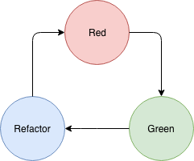

# Test Driven Development

## C'est quoi ?

```
In layman’s terms, Test Driven Development (TDD) is a software development practice that focuses on creating unit test cases before developing the actual code. It is an iterative approach that combines programming, the creation of unit tests, and refactoring.
```

Le TDD, c'est une méthode differente pour créer un logiciel.

Plutot que d'essayer de commencer par concevoir du code, on se penche d'abbord sur les resultats qu'on souhaite obtenir.

Les tests, representent et verifient ces resultats pour nous, c'est pourquoi, avec le TDD, on commence par créer des tests.

Alors, certes, le TDD c'est commencer par les tests mais pas que.

## Les étapes du TDD

1. On choisit la feature qui nous semble la plus simple et la plus petite.
> de cette manière, plus on avance dans notre code, plus les features complexes seront déja en partie implementées

2. On écrit un test pour cette feature
> On essaye d'écrire le test, la façon la plus précise possible, en verifiant tout les types de cas possibles.

3. On lance le test, on s'assure qu'il echoue bien.
> Si le test n'échoue pas, c'est que notre test n'est pas efficace, que l'on a pas rajouté de logique dans notre test

On reste a cette étape tant que le test n'est pas rouge.

4. On corrige le code pour que notre test fonctionne correctement.
> ici, on doit etre [feignant et de mauvaise fois](https://en.wikipedia.org/wiki/You_aren%27t_gonna_need_it) : notre seul objectif c'est de rendre le test vert, faire passer nos tests sans echecs.

On reste a cette étape tant que les tests ne sont pas vert.

5. Une fois que tout est vert, on refactor notre code
> c'est une étape importante, on regarde si on a du [code dupliqué](https://en.wikipedia.org/wiki/Don%27t_repeat_yourself) ou du code qui ne respecte pas les principes [SOLID](https://en.wikipedia.org/wiki/SOLID)

On reste a cette étape tant que les tests ne sont pas vert. (ici, c'est important de ne pas avoir de regressions)

6. On regarde si notre feature à besoin d'un autre test

> si oui, on retourne à l'étape 2

> si non, on passe a une autre feature à l'étape 1

<p align="center"></p>

<p align="center"></p>

## Pourquoi ?

- C'est sécurisant pour tout le monde.

Les tests donnent une vision très claire de ce qui est fait et de ce qui reste a faire

> Le developpeur est sur de son avancé, on ne se trompe pas dans la conception, puisqu'on avance avec nos tests.

> Le PO, est au courant de l'avancé des differentes features (grace aux tests).

- Cela fonctionne bien avec le development Agile
> Quand une feature change, il suffit de changer le test pour etre sur de livrer ce qui est demandé

- Le test coverage est naturellement très élevé

- Le code produit n'est over-engineered [YAGNI](https://en.wikipedia.org/wiki/You_aren%27t_gonna_need_it)

- Le code produit est plus fexible

- On peut commencer sans avoir l'integralité des specifications

## Pourquoi Pas (ou plutot quand ne pas utiliser le TDD) ?
Le TDD represente une charge de travail en plus (qui est de toute façon présente quand on rajoute des tests).


- quand on fait du code 'jetable'

- on arrive dans une code base qui n'a pas de tests. (faire du TDD c'est assez lourd et si l'application marche sans, c'est peu efficace)

- votre équipe a quelqu'un pour la QA, meme si ça ne dispense pas de faire les tests, c'est le role de cette personne de les écrire et de s'assurer que tout fonctionne bien, il est inutile de s'encombrer avec le TDD

## Mais en vrai, c'est utile quand ?

N'utiliser le TDD que sur les features compliquées, s'en passer quand on fait des choses simples